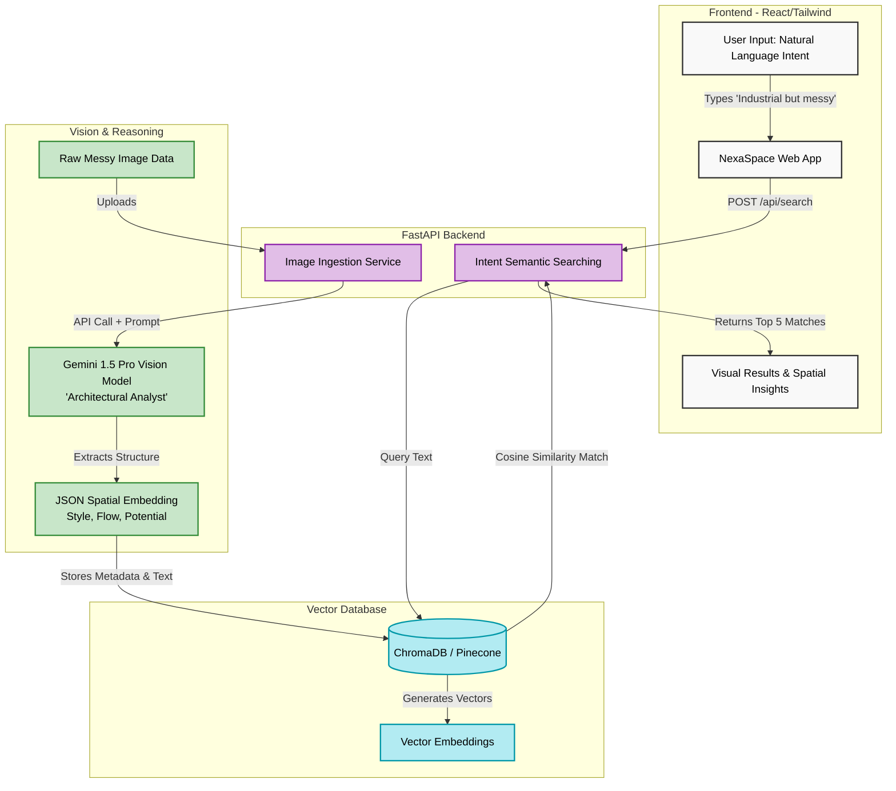

# NexaSpace Architecture

This diagram visualizes the autonomous spatial reasoning pipeline. You can use this directly in your hackathon presentation.

## How to use this:
You can copy the code block above into a Mermaid Live Editor (https://mermaid.live/) or directly into Notion/GitHub to instantly generate a professional architecture slide for your pitch deck.
